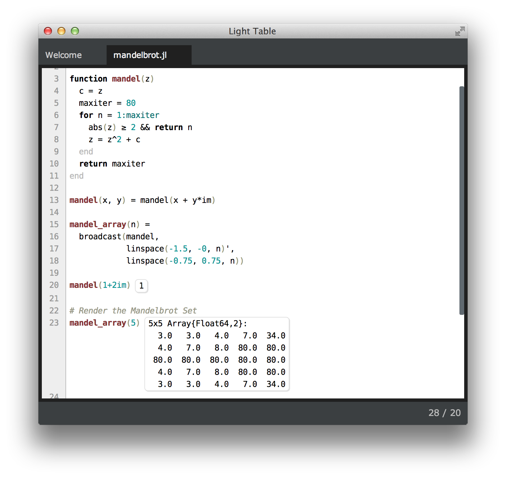
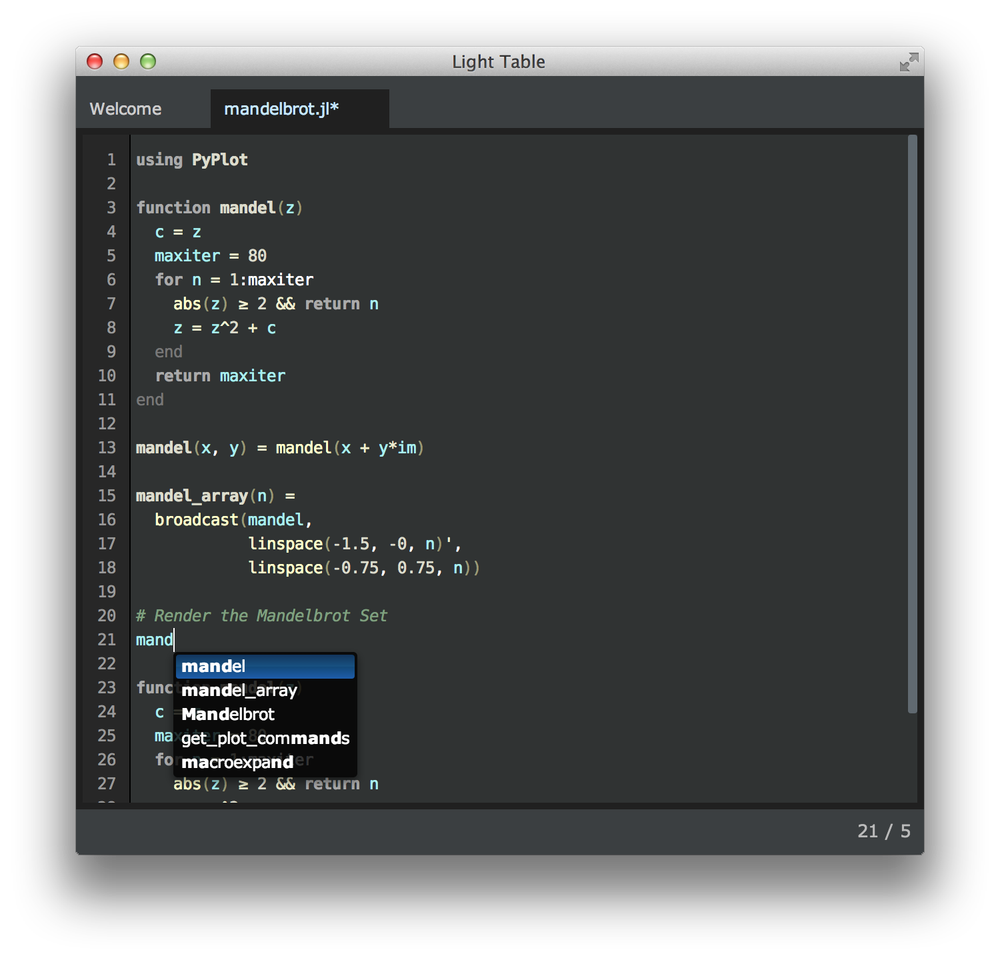

June
====

The June themes are two themes for Light Table. June includes nicer defaults for inline results and exceptions, and comes bundled with the excellent [DejaVu](http://dejavu-fonts.org/wiki/Main_Page) font.

June Night also comes with hash highlighting – every identifier is given assigned a random (but consistent) colour. This is a really heplful extra cue when scanning many similarly-named variables.

To use, install the plugin and set the theme in your user behaviours file. The font settings are applied by default, but won't override any in your user behaviours. To get the nice glassy autocomplete menu, add `(:lt.object/add-tag :app.june-dark-autocomplete)` to the `:app` tag.

